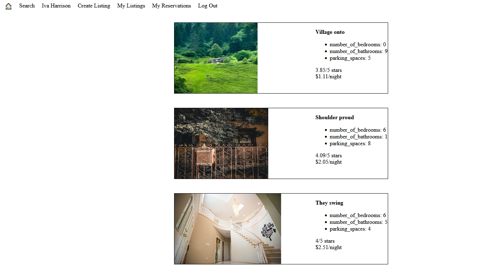
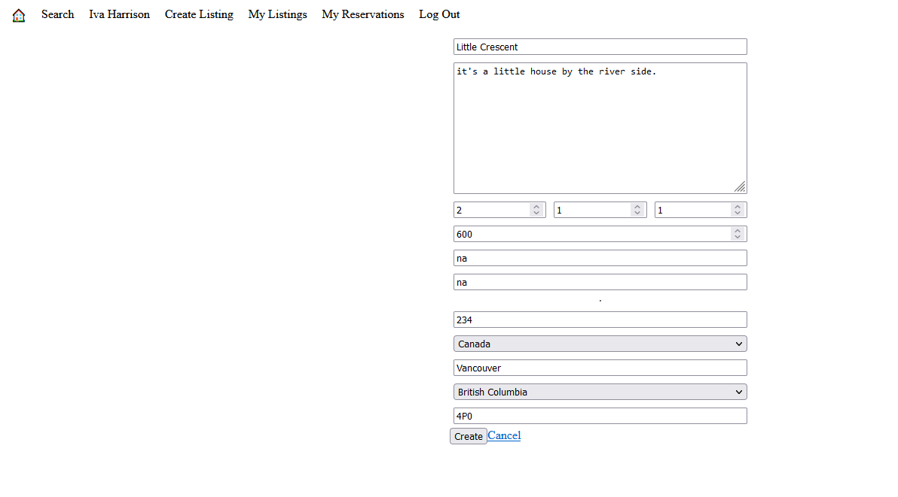
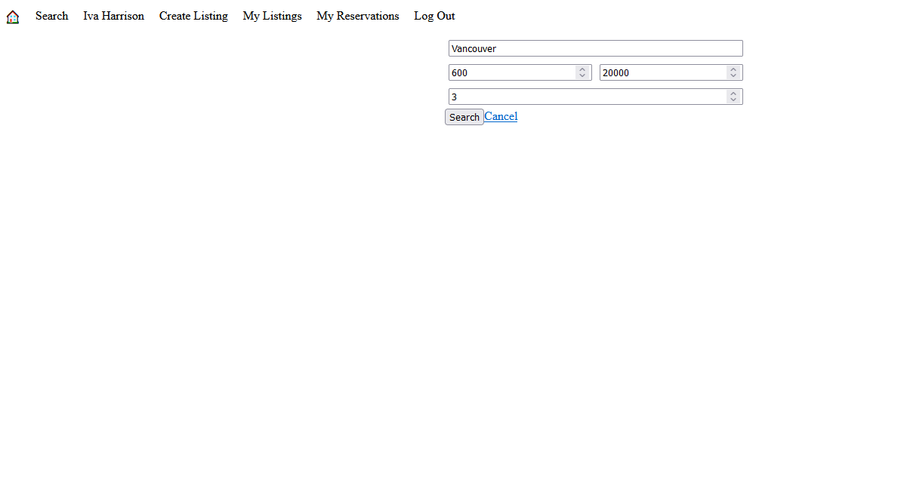

# LightBnB
A simple multi-page Airbnb clone that uses server-side Javascript to display the information from queries to web pages via SQL queries. Has the functionalities of being able to create accounts, view other listings, create own listing, and filtering though results.

## Screenshots
Listings Homepage

Create Listing

Search Filters

## Getting started
1. [Create](https://docs.github.com/en/repositories/creating-and-managing-repositories/creating-a-repository-from-a-template) a new repository using this repository as a template.
2. Clone your repository onto your local device.
3. Install dependencies using the `npm install` command.
3. Start the web server using the `npm run local` command. The app will be served at <http://localhost:3000/>.
4. Go to <http://localhost:3000/> in your browser.